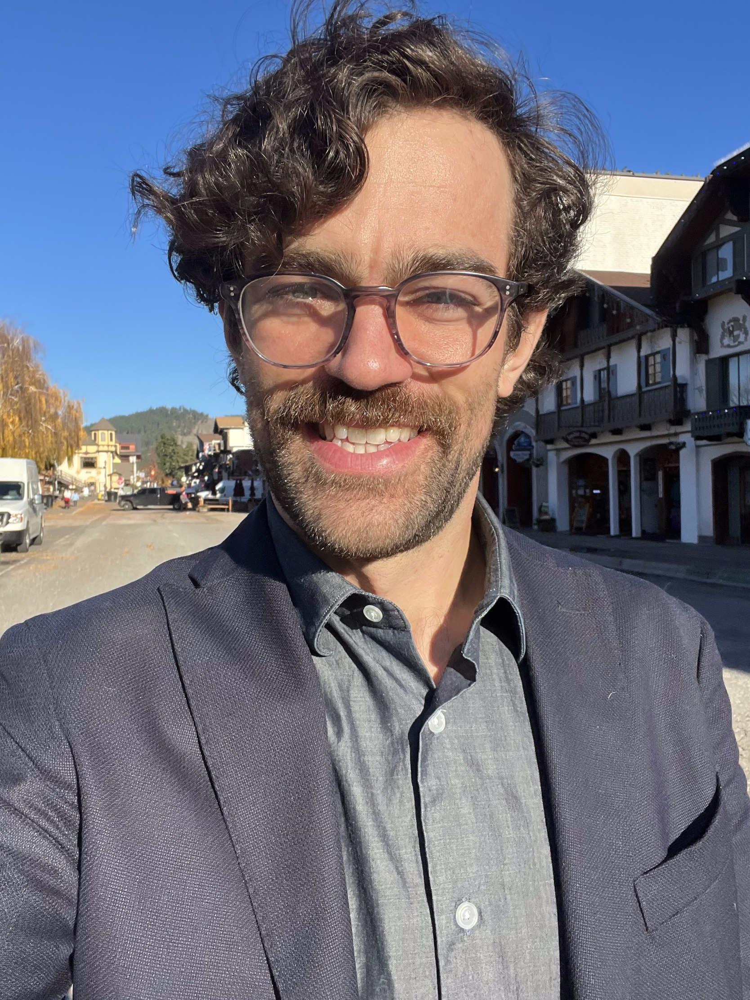

  

    
  

  

    <h1>Contact</h1>
    
Phone: +1-425-903-6445

    
Email: <a href="mailto:murraypendergrass0@gmail.com">murraypendergrass0@gmail.com</a> 

    
LinkedIn: <a href="https://www.linkedin.com/in/mmpendergrass/">MMPendergrass</a>
 
    
GitHub: <a href="https://github.com/MurrayPendergrass">MurrayPendergrass</a>

  

# Welcome to my website!
My name is Murray Pendergrass. This is where I show some of my personal projects. I mostly work in the intersection of data science and actuarial science.

# Education
## MS Mathematics
_Western Washington University_, 2018   
GPA: 3.58  
Teaching Assistant  
[WWU Transcript](transcripts/Academic History.pdf)

## BS Mathematics
_Western Washington University_, 2017  
GPA: 3.94  
Math Fellow   
Honors Graduate  
Outstanding Graduate Award  
[WWU Transcript](transcripts/Academic History.pdf)

# Interests
* Fraud Detection

* Humanitarian Efforts - I am very interested in the application of machine learning and data science to empowering humans, prevent negative socioeconomic outcomes, and environmental problem solving.

* Indigenous Empowerement  - As a descendant of the Blackfeet Nation, I have a vested interested in using my time and resources to advocate for Indigenous people and empower Indigenous voices. 

* Climbing - I enjoy recreating in the mountains. I love skiing and trail running, but mostly alpinism - the art of climbing technical peaks via ice and rock climbing.

* In my spare time I work as a mountain guide for Climbers of Color, a 501(c)(3) nonprofit guide service that subsidizes courses for black, indigenous, and people of color in an effort to diversify recreation in the outdoors. My bio for Climbers of Color can be found <a href="https://www.climbersofcolor.org/our-team" target="_blank"> here </a>.

# Professional Documents
| <a href="https://murraypendergrass.github.io/resume/Resume.pdf" target="_blank"> Resume </a> |

# Portfolio
You can click on each of the project headers to visit the GitHub repository for each project.

## [Mountain Soup](https://github.com/MurrayPendergrass/Mountain_Soup)
Mountain soup uses a scraping library in Python to extract information from a database website and send an automated email to users of the program. \
Tools: Python (Beautiful Soup, smtplib)

## [Wine Quality Prediction](https://github.com/MurrayPendergrass/Wine-Quality-Prediction)
This project uses a supervised machine learning model to automate the process of predicting wine quality based on 11 attributes of each wine. A full analysis is conducted with next steps for model improvement. \
Tools: Jupyter, R (randomForest, Hmisc, ggplot2)

## [In Progress](https://github.com/MurrayPendergrass?tab=repositories)
The above takes you to my general GitHub directory where all of my repositories can be accessed. I am currently working on uploading more ML modeling projects to GitHub.

## Thank You For Visiting

